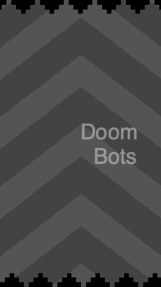

# Doom Bots - Phaser 3 JS and Webpack

This is a clone of the game Boom Dots. It was inspired by this 
[tutorial](http://codetuto.com/2018/02/getting-started-phaser-3-es6-create-boomdots-game/), and was built with on this [Phaser 3 Webpack 
starter project](https://github.com/soggybag/phaser3-project-template). 

[Phaser 3 JS](https://photonstorm.github.io/phaser3-docs/index.html) 
is a library for making games with JavaScript. 

<figure style="width: 270px; margin: auto">
    
    <figcaption>
        
Blast the Doom Bots!

    </figcaption>
</figure>

## Requirements

To run this project you will need to have [Node.js](https://nodejs.org).

## Install and run

Download the project file and navigate to the project folder with the terminal. 

Next install dependencies with: 

`npm install`

From here you can run the project locally with: 

`npm start`

This should start a local server on your computer. Navigate to http://localhost:8000 in a browser to play the game. 

Stop the server by pressing `control + c` in the terminal. 

## Todo

The game is in process and needs work. 

- Add Score 
- Change background color as levels progress
- Incrementally increase the alien speed 
    - Currently the game has a fixed range for the speed of the alien. This imposes a fixed difficulty. The goal of this item is to add increased difficuly over time. 
- Improve Preload screen
- Add custom fonts
- 